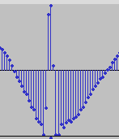
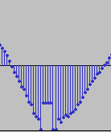

Title: Click removal in audio files with Python
Date: 2023-05-23 8:00
Category: Audio, Python
Tags: Audio, Python

A friend of mine had an audio file with many clicks in it. He asked me if I
could remove them. I tried with the Audacity click removal tool, but it didn't
work: it removed the clicks, but created a lot of artifacts in the audio, so I
thought it would be a nice challenge to try to do it with Python.

The waveform looked like this:



I did it using the [pydub](https://github.com/jiaaro/pydub) package. The basic
idea is detecting the clicks and replacing them with the previous sample. I
used two different criteria to detect the clicks:

- If the average of the previous samples is below a threshold and the current
  sample is above another threshold.

- If the difference between the previous sample and the current one is above a
  threshold.

The code is not very clean, but it worked. I had to play with the thresholds
and the width of the samples to get the best results. I also had to play with
the width of the clicks to avoid removing too much audio.

The result was pretty good. The waveform looked like this:



And the audio sounded much better. It was not perfect, but it was good enough.

The code is below. The audio file is not included.

```python
from pydub import AudioSegment
from rich.progress import track

# Read file
FILE_NAME = "original"
audio = AudioSegment.from_file(f"{FILE_NAME}.wav", format="wav")


def big_avg_diff(seq, sample, threshold):
    avg = sum(seq) / len(seq)
    return avg < -threshold and sample > threshold


# Get samples
samples = audio.get_array_of_samples()

# Declick
num_clicks = 0
width = 2
max_click_width = 20
threshold_avg = 10000
threshold_abs = 18000
i = 10
while i < len(samples):
    if (
        big_avg_diff(samples[i - width : i], samples[i], threshold_avg)
        or abs(samples[i - 1] - samples[i]) > threshold_abs
    ):
        print(f"Found click {num_clicks} at {i:_}: {samples[i - width: i+1]}", end="")
        num_clicks += 1
        click_width = 0
        while (
            abs(samples[i] - samples[i - 1]) > threshold_abs
            and click_width < max_click_width
        ):
            samples[i] = samples[i - 1]
            i += 1
            click_width += 1
        print(f" (width: {click_width})")
    else:
        i += 1

print(f"Found {num_clicks} clicks")

# Save new audio from samples
new_audio = audio._spawn(samples)
new_audio.export(f"{FILE_NAME}_declicked.wav", format="wav")
```
